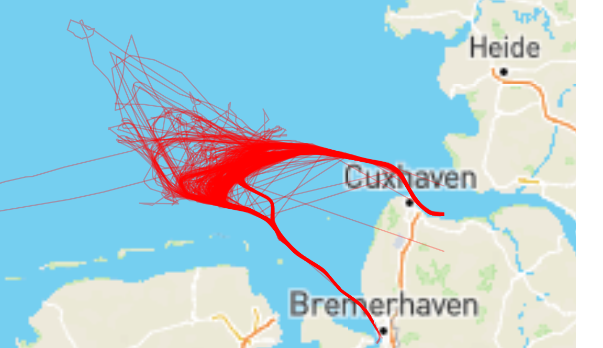

# Ship Routes Analyzer

Ship Routes Analyzer is responsible for selecting the most representative route from the given routes.

### Definition of "the most representative route"

First of all, it is needed to define what the most representative route is. Based on the historical ship's routes, we can extract the following data:
- "id" - ship id
- "from_seq" and "to_seq" - logical route id
- "from_port" - this is a starting port
- "to_port" - this is the destination port
- "leg_duration" - length of the route in milliseconds
- "count" - number of positions read/points on the route
- "points" - an array of position points - format: [longitude, latitude, time in epoch, instantaneous speed]

For example:

```csv
"id","from_seq","to_seq","from_port","to_port","leg_duration","count","points"
"imo_9462794","127","128","DEBRV","DEHAM","36406308","135","[[8.489074, 53.615707, 1509423228430, 14.0],...,[9.909705, 53.53625, 1509459634738, 0.0]]"
"imo_9454230","196","197","DEBRV","DEHAM","37389167","155","[[8.48967, 53.614338, 1507290057531, 12.5],...,[9.937747, 53.4988, 1507327446698, 0.0]]"
```

Let's have a look at the visualization of the historical data:



As we can see, there are some of the most popular routes (the highest density of routes). Based on that, we can define that the most representative route is the route which is the most popular route.

### Algorithm of selecting the most representative route (the most popular)

1. First, calculate the distance for each route.
2. Extract the most popular distance
3. Select the most frequent route for the given distance (the most representative route)


### Build the application

The application can be build using maven and JDK 11:

```
./mvnw clean package
```

### Run

To run the application you can simply use the following command:

```
java -jar ship-routes-analyzer-1.0-SNAPSHOT-jar-with-dependencies.jar
```

If you want to use your own CSV file with historical routes, you can run the application as follows:

```
java -jar ship-routes-analyzer-1.0-SNAPSHOT-jar-with-dependencies.jar <PATH_TO_CSV_FILE>/your_file.csv
```